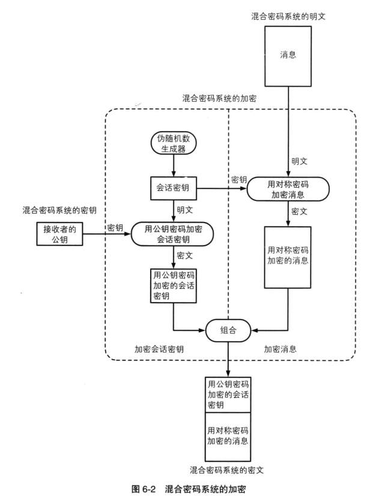
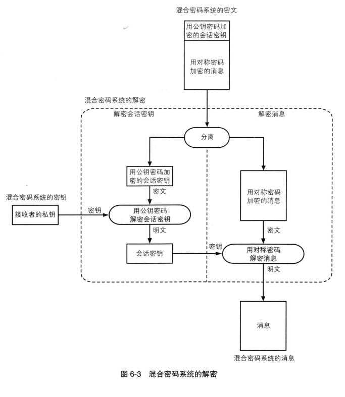

# 对称密码与公钥密码及混合密码系统
>小贱提示：
>
>公钥密码又分为非对称密码


## 分组密码（对称密码）

#### 分组密码的模式

|   模式  |  说明   |
| --- | --- |
| ECB	| 电子密码本模式|
| CBC	| 密码分组链接模式，此模式需要一个初始化向量IV|
| CFB	| 密文反馈模式，此模式需要一个初始化向量IV|
| OFB	| 输出反馈模式，此模式需要一个初始化向量IV|
| CTR	| 计数器模式|

#### 栅栏密码
密文分成n组，每组首字母相连
#### AES
要素：

密钥值key

待加密的数据（明文）

加密后的数据（密文）
#### TripleDES/3DES
要素：

密钥值key

加解密模式CipherMode

待加密的数据（明文）

加密后的数据（密文）

#### DES
## 公钥密码
#### RSA加密
加密公式：
```
密文=明文**E mod N
即密文=明文的E次方，再除以N的余数
E和N的组合为加密密钥，即公钥，一般写成(E,N)或{E,N}
```
#### RSA解密
解密公式：
```
明文=密文**D mod N
明文=即密文的D次方，再除以N的余数
D和N的组合为解密密钥，即私钥，一般写成(D,N)或{D,N}
```
#### 生成密钥对步骤
##### 第1步：求N

准备两个很大的质数，p和q，N=p*q

##### 第2步：求L （L是p-1和q-1的最小公倍数,lcm表示最小公倍数）

L=lcm(p-1,q-1)

##### 第3步：求E
1<E<L 且 gcd(E,L)=1       //gcd（E,L）=1表示E和L最大公约数为1（即互质）

##### 第4步：求D

1<D<L 且 E*D mod L=1

举个简单的例子：
```
求	N	：	设p=17,q=19 则N=17*19=323
求	L	：	L=16和18的最小公倍数，即L=144
求	E	：	1<E<144,且 E和144互质。满足的有很多：5，7，13等等，随便选个E=5
到这里就知道E=5,N=323是公钥
求	D	：	1<D<144,且 5*D mod 144 = 1。挨个试，发现D=29满足
则结果为：
公钥：E=5		,	N=323
私钥：D=29	,	N=323
```
## 混合密码系统





__原创文章，转载请注明转载自[http://www.8pwn.com](http://www.8pwn.com)__

[返回上一层](./crypto)
