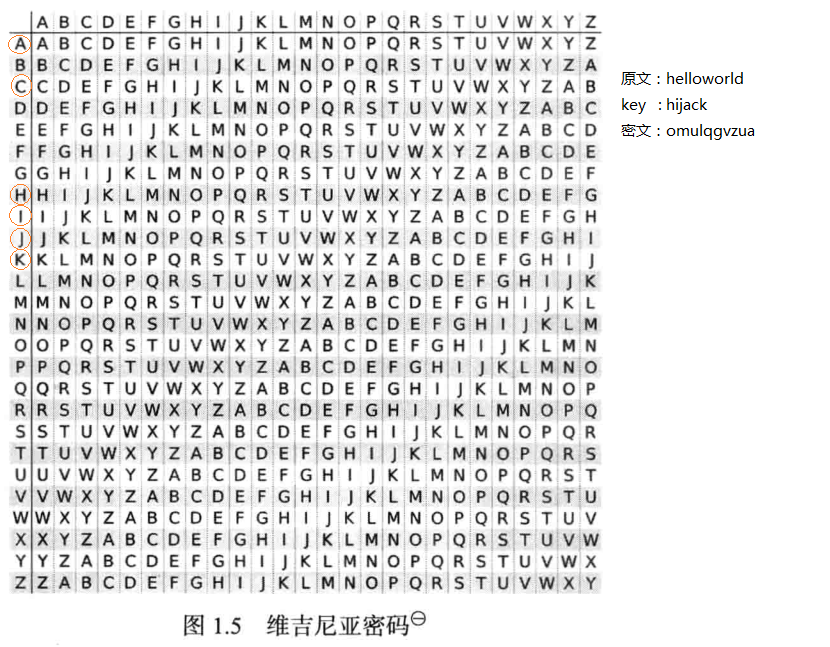

# 一些常用密码的辨别


## md5和base64区别
md5 16位（第二个参数为TRUE时）或32位（第二个参数为FALSE时），

base64有==结尾
## 凯撒密码
错位

密钥为3的凯撒密码相当于“加3后除以26的余数”
## MD5原理
#### 第一步：增加填充padding

如果输入信息的长度(bit)对512求余的结果不等于448，就需要填充使得对512求余的结果等于448。

填充的方法是填充一个1和n个0。填充完后，信息的长度就为N*512+448(bit)；

#### 第二步：记录信息长度
用64位来存储填充前信息长度。这64位加在第一步结果的后面，这样信息长度就变为N*512+448+64=(N+1)*512位。

#### 第三步：初始化变量：
装入标准的幻数（四个整数）：标准的幻数（物理顺序）是
```
A: 01 23 45 67
B: 89 ab cd ef
C: fe dc ba 98
D: 76 54 32 10
```
#### 第四步：数据处理：
首先定义4个辅助函数：
```
F(X,Y,Z) = XY v not(X) Z
G(X,Y,Z) = XZ v Y not(Z)
H(X,Y,Z) = X xor Y xor Z
I(X,Y,Z) = Y xor (X v not(Z))
```
其中：XY表示按位与，X v Y表示按位或，not(X)表示按位取反。xor表示按位异或。
函数中的X、Y、Z均为32bit。

定义一个需要用到的数组：T(i),i取值1-64,T(i)等于abs(sin(i))的4294967296倍的整数部分,i为弧度。

假设前三步处理后的数据长度为32*16*Nbit

#### 第五步：输出：
最后得到的ABCD为输出结果，共128bit。A为低位，D为高位。
## 维吉尼亚密码
密码表被设置为多行，每一行给一个字母做凯撒加密

例如：

## 格栅密码
做一个板子，抠几个洞，读入洞洞字母拼接成一句话
## base64/32
Base64：
```
所谓Base64，就是说选出64个字符----小写字母a-z、大写字母A-Z、数字0-9、符号"+"、"/"（再加上作为垫字的"="，实际上是65个字符）----作为一个基本字符集。然后，其他所有符号都转换成这个字符集中的字符。
```
Base32:包含26个大写字母和2-7的数字,（再加上作为垫字的"="，实际上是33个字符）
## jsfuck
形如：
```
[][(![]+[])[+[]]+([![]]+[]
```
## brainfuck/Ook
brainfuck：形如->+++ ++<]> +++++

Ook：形如Ook. Ook. Ook! Ook? Ook!
## 古典密码
根据出现频率猜测

__原创文章，转载请注明转载自[http://www.8pwn.com](http://www.8pwn.com)__

[返回上一层](./crypto)
