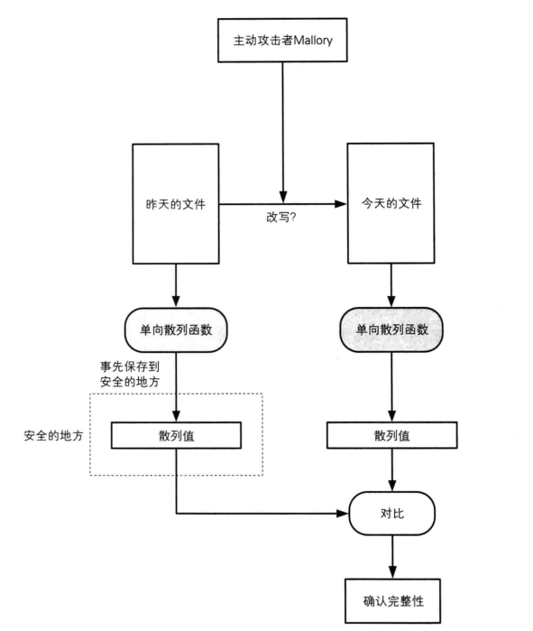
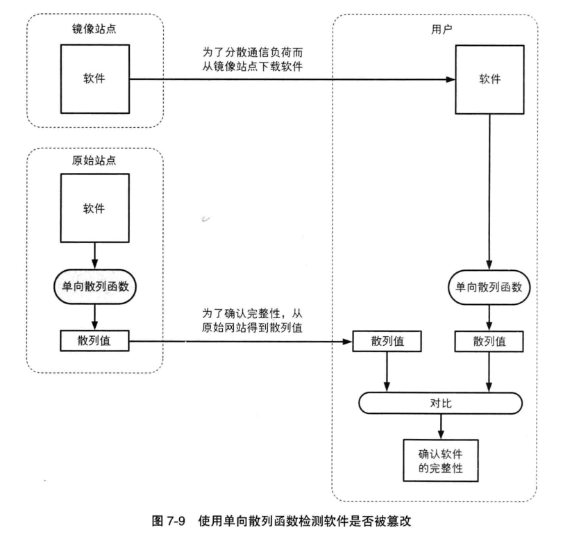
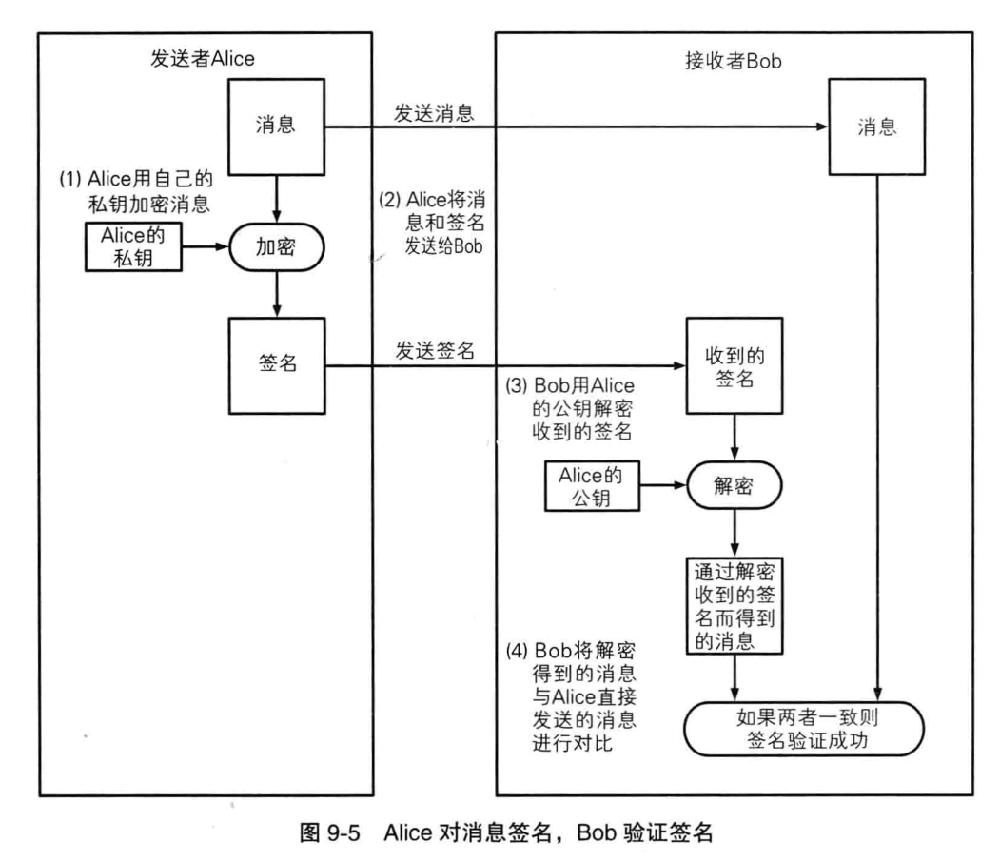
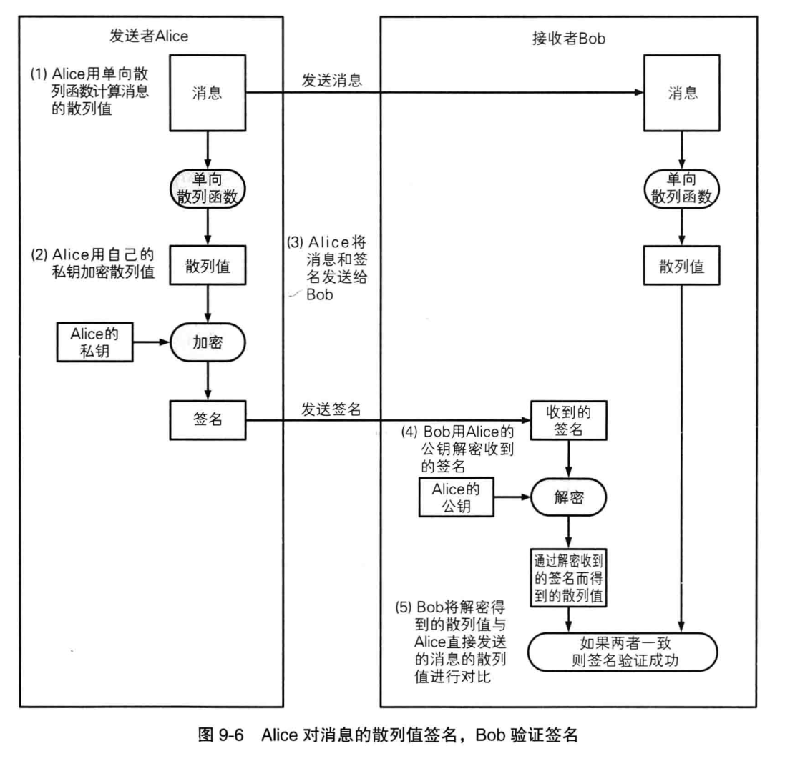

# 单向散列函数
>小贱提示：
>
>单向散列函数又称为：
>
>信息摘要函数,信息摘要函数,杂凑函数

单向散列函数的作用：将很长的消息剁碎，然后混合成固定长度的散列值

输入单向散列函数的消息称为：原像

输出的散列值称为：信息摘要或指纹

## 确认完整性示意图

## 单向散列函数的性质
1. 根据任意长度计算出固定长度的散列值
2. 消息不同散列值也不同（不绝对）
    ```
    单向散列函数具有弱抗碰撞性和强抗碰撞性

    弱抗碰撞性：
    要找出和消息A具备相同散列值的另一条消息是非常困难的

    强抗碰撞性：
    要找出具有相同散列值但互不相同的两条消息是非常困难的
    ```
3. 单向性
    不可逆

## 单向散列函数的的实际应用
#### 检测软件是否被篡改


#### 基于口令的加密（PBE）
PBE原理是将口令和盐（salt,通过伪随机数生成器产生的随机值）混合后计算其散列值
然后将这个散列值作为加密的密钥
#### 消息认证码
消息认证码是将“发送者和接收者之间的共享密钥”和“消息”进行混合后计算出的散列值。

消息认证码可检测并防止通信过程中的错误，篡改，及伪装

#### 数字签名
证明消息到底是谁写的并且防止否认，数字签名是随着消息的改变而改变的



数字签名非常耗时，因此，一般不会对整个消息进行数字签名，而是先计算消息的散列值，再对这个散列值施加数字签名

#### 可以构造伪随机数生成器
#### 可以构造一次性密码
__原创文章，转载请注明转载自[http://www.8pwn.com](http://www.8pwn.com)__

[返回上一层](./crypto)
