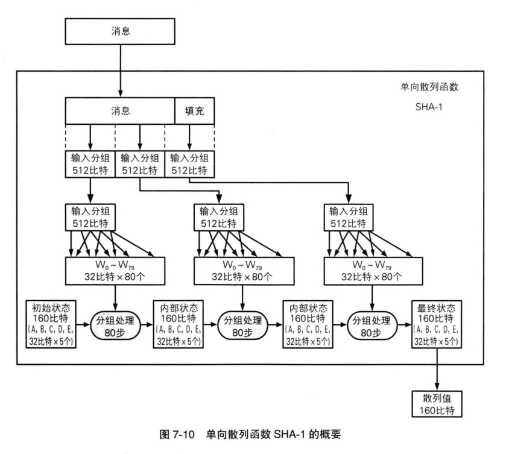

# 单向散列函数举例

## MD4，MD5

MD5的散列值长度为16位或32位

MD5的强抗碰撞性已经被攻破，
也就是说，现在已经能够产生具备相同散列值的两条不同的消息，因此，已经不再安全了

MD的意思就是消息摘要（Message Digest）
## SHA-1

|     |   散列值长度  |   消息长度上限  |
| --- | --- | --- |
|   SHA-1  |  160 bit   |   接近于264 bit  |

SHA-1的强抗碰撞性已经被攻破，
也就是说，现在已经能够产生具备相同散列值的两条不同的消息，因此，已经不再安全了
#### SHA-1流程

## SHA-256、SHA-348、SHA-512
统称为SHA-2，目前尚未攻破

|     | 散列值长度 | 消息长度上限 |
| --- | ---------- | ------------ |
| SHA-256| 			256 bit			| 		接近于2^64 bit|
| SHA-384| 			384 bit			| 		接近于2^128 bit|
| SHA-512| 			512 bit			| 		接近于2^128 bit|

## AHS与SHA-3
## RIPEMD-160
散列值长度为160比特
目前尚未攻破

__原创文章，转载请注明转载自[http://www.8pwn.com](http://www.8pwn.com)__

[返回上一层](./crypto)
