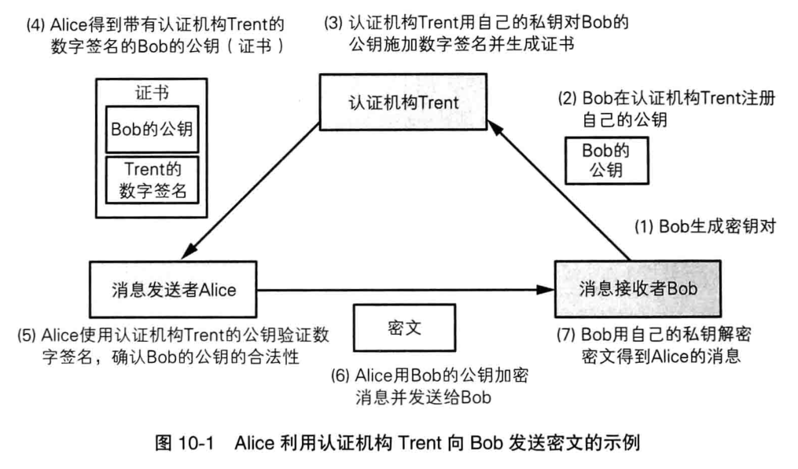
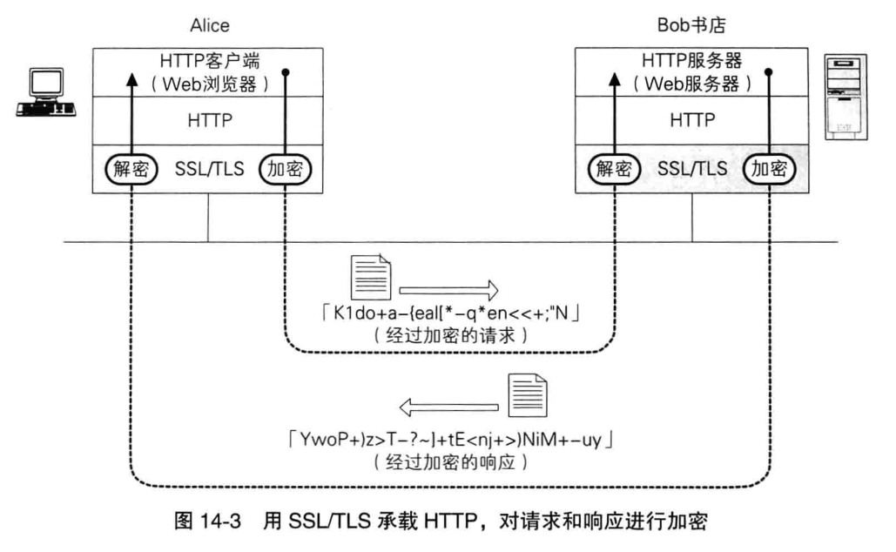

# 证书及SSL/TLS
>小贱提示：
>
>证书就是为公钥加上数字签名
>
>SSL/TLS提供了一种密码通信的框架,TLS实际上是SSL的升级版

## 证书的概念
当数字A数字签名后，用户拿着A的公钥来验证A的消息，可是用户怎么才能知道A的公钥确实是公钥呢？这时候就需要证书。

公钥证书和驾照相似，有姓名，组织，邮箱，地址等及属于此人的公钥，并由认证机构（如VeriSign）施加数字签名。

举例：

## SSL/TLS

__原创文章，转载请注明转载自[http://www.8pwn.com](http://www.8pwn.com)__

[返回上一层](./crypto)
