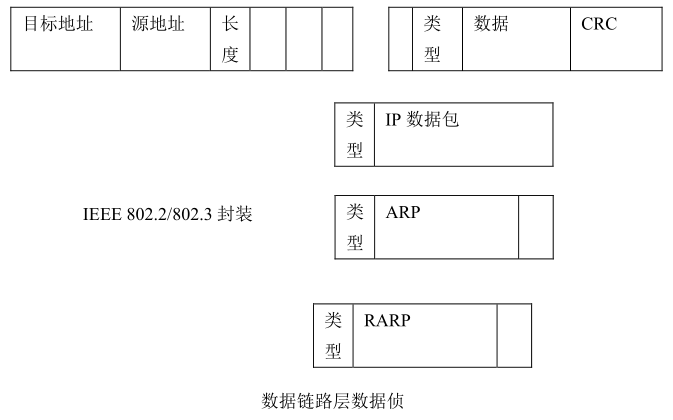

# OSI七层模型与TCP/IP层次模型及三次握手

## OSI七层模型
数据自下而上传输
#### 1、物理层：
网线，物理端口，设备等

#### 2、数据链路层：
在物理层的传输能力基础上以帧为单位传输数据，该曾使用的协议有：SLIP，PPP，X25，帧中继等，如下图

#### 3、网络层：
功能是提供路由，机到达目的的最佳路径，并沿着该路径传送数据包，路由器就是这一层的

#### 4、传输层：
提供数据传输的

#### 5、会话层：
利用传输层来的数据增加的会话服务，如通过网络登陆到一个主机

#### 6、表示层：
就是表示数据用的

#### 7、应用层：
应用程序及其所需要的协议和功能

## TCP/IP四层模型
#### 1、主机到网络层 (以太网 FDDI ATM 和 Token Ring (令牌环)):

相当于 OSI 模型中的物理层加上数据链路层 是 TCP IP 结构中的最低层 ,负责从上层接收 IP数据包并把 IP 数据也进一步处理成数据帧发送出去 或从网络上接收物理帧 解开数据帧 抽出 IP 数据包 并把数据包交给 IP 层

#### 2、网络互连层：
相当于 OSI 模型中的网络层 有关 IP 层的数据结构和路由的实现。

#### 3、传输层：

TCP 是面向连接的 可靠的

而 UDP 正好相反

TCP 一般用于传输硬件可靠性差的广域网，

而 UDP 用于硬件可靠性好的局域网

#### 4、应用层

>小贱提示：
>在 TCP/IP 中数据包的特点是一层套一层的每一个协议层用特殊的连接围绕上一层的数据包 像洋葱层一样 在每一层 数据包分为报头和本体 报头包括与该层相关的控制信息 而本体是从上一层传下来的数据 每一层把上一层的数据作为本体 并且加上本层适当的报头控制信息 然后再交给下一层处理。

## TCP三次握手：

 一般来说,除了第一个包,后面的包的 ACK 位被置 1,所以查看 ACK 位便可确定此包是否用来发出连接请求

__原创文章，转载请注明转载自[http://www.8pwn.com](http://www.8pwn.com)__

[返回上一层](./misc)
