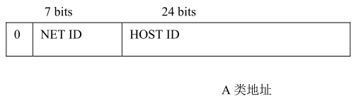
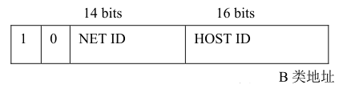
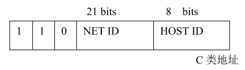
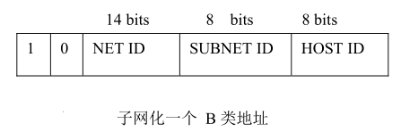

# IPv4中的A,B,C类网及子网掩码
>小贱提示： IP 地址的主要类型有五种 A B C D 和 E。 一般 A B C 类地址更为常用， 每类地址都是由 32 位或 4 个字节组成

## A类地址
在 A 类地址中第一个 8 位字节表示网络部分 其余 3 个 8 位字节用来标识主机 如图 1-4 所示A 类 IP 地址的第一段数字范围为 1-127，每个 A 类地址可连接 16387064 台主机（254*254*254）， Internet 上有 126 个 A类地址（0不用，127不用）

 

## B类地址
在 B 类地址中 两个 8 位字节表示网络部分 其余两个 8 位字节表示主机 如图 1-5 所示 B 类IP 地址的第一段数字范围为 128-191， 每个 B 类地址可连接 64516 台主机（254*254）， Internet 上有 16256 个 B 类地址 //（191-128+1）*254

## C类地址
C 类地址使用 3 个 8 位字节作为网络部分 只有一个 8 位字节留给主机 如图 1-6 所示 C 类 IP地址的第一段数字范围为 192-223， 每个 C 类地址可连接 254 台主机（一个网关，一个广播，不能做主机） Internet 上有 2054512 个 C 类地址//（223-192+1）*254*254

## D类地址
用作多目的地信息的传输 作为备用， D 类 IP 地址的第一段数字范围为 224-239
## E类地址
保留 仅作为 Internet 的实验和开发之用， E 类 IP 地址的第一段数字范围为 240-254

## 关于子网掩码

可以发现 A 类或 B 类网络拥有数以千计或数以百万计的主机,这是不切合实际的,因为不可能有任何一个网,其主机数会有这么多 为了解决这个问题人们发明子网 Subnet(子网) 的概念，就是把 A B 类地址进一步地细化

子网掩码是一个 二进制为32 位的值，其中网络 ID 和子网 ID 部分全部被置 1，主机的部分被置零，当知道了子网掩码和一个主机的 IP 地址,如果想得到网络号和子网号 可以把子网掩码和 IP 地址进行位运算中的 AND 运算 这样就去掉了主机号，剩下的网络号
和子网号可以通过地址类型来进行分离

来举个栗子：

146.64.127.7  子网掩码  255.255.255.0 ，求网络号，子网号，主机号

255.255.255.0的二进制为11111111，11111111，11111111，00000000

146.64.127.7 AND 255.255.255.0 =146.64.127.0 //这一步去掉了主机号，这样主机号也确定了，是7

接下来146.64.127.0怎么分别子网号和网络号呢？

我们来看第一段：146，根据上面分辨，这是个B类地址，B类地址的网络号为前两段，也就是：146.64

那么子网号也出来了：127

下面说说关于类似192.168.1.0/24这个问题，其实如果上面认真看了，这个一说就明白了，/24就表示子网掩码，前24位置1，即子网掩码为255.255.255.0

再举个例子，192.168.1.0/16子网掩码是多少？没错，就是255.255.0.0

__原创文章，转载请注明转载自[http://www.8pwn.com](http://www.8pwn.com)__

[返回上一层](./misc)
