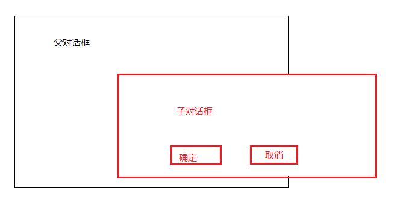

# 调试时值得重视的API函数
>小贱提示： 这篇文章是我在看雪上面发表的，就是针对API查找断点的
>
>对于这些API函数，并不需要背，等到需要的时候来查一下就好


## 限制程序功能的函数，按钮变灰啦，不能点击啦这种的

| API            | 作用                                                   |
| -------------- | ------------------------------------------------------ |
| EnableMenuItem | 菜单变灰或禁止                                         |
| EnableWindow   | 允许或禁止鼠标和键盘控制指定窗口和条目(禁止时菜单变灰) |

## 对话框函数
### 提到这里，就顺便说下什么是非模态对话框，什么是模态对话框吧
（PS：主要目的是秀一下我高超的绘画功底，哈哈）


```
看上边的我的绘图，模态对话框，我为了便于记忆，起了个名字叫做变态对话框，
因为每次模态对话框出来的时候，不点击确定或者取消，父对话框无法操作，太变态了，所以我就叫变态对话框，单纯是为了防止记混。

那么非模态对话框就不用我说了吧，恰恰相反，不点击确定或取消同样可以操作父窗口，再也不用听到咚咚的噪音了。
```

| API                       | 作用                                                                                 |
| ------------------------- | ------------------------------------------------------------------------------------ |
| CreateDialog              | 从资源模板建立一非模态对话窗                                                         |
| CreateDlalogParam         | 从资源模板建立一非模态对话窗                                                         |
| CreateDialogIndirect      | 从内存模板建立一非模态对话窗                                                         |
| CreateDialogIndirectParam | 从内存模板建立一非模态对话窗                                                         |
| DialogBox                 | 从资源模板建立一模态对话窗                                                           |
| DialogBoxParam            | 从资源模板建立一模态对话窗                                                           |
| DialogBoxIndirect         | 从内存模板建立一模态对话窗                                                           |
| DialogBoxIndirectParam    | 从内存模板建立一模态对话窗                                                           |
| EndDialog                 | 结束一模态对话窗                                                                     |
| MessageBox                | 显示一信息对话框                                                                     |
| MessageBoxEx              | 显示一信息对话框                                                                     |
| MessageBoxIndirect        | 显示一定制信息对话框                                                                 |
| GetDlgItemInt             | 得指定输入框整数值                                                                   |
| GetDlgItemText            | 得指定输入框输入字符串                                                               |
| GetDlgItemTextA           | 得指定输入框输入字符串                                                               |
| Hmemcpy                   | 内存复制  非应用程序直接调用，就是万能断点啦，只有XP能用，不过大家应该都有XP虚拟机吧 |

## 磁盘处理函数

| API                   | 作用                                                  |
| --------------------- | ----------------------------------------------------- |
| GetDiskFreeSpaceA     | 获取与一个磁盘的组织有关的信息 以及了解剩余空间的容量 |
| GetDiskFreeSpaceExA   | 获取与一个磁盘的组织以及剩余空间容量有关的信息        |
| GetDriveTypeA         | 判断一个磁盘驱动器的类型                              |
| GetLogicalDrives      | 判断系统中存在哪些逻辑驱动器字母                      |
| GetFullPathNameA      | 获取指定文件的详细路径                                |
| GetVolumeInformationA | 获取与一个磁盘卷有关的信息                            |
| GetWindowsDirectoryA  | 获取 Windows 目录的完整路径名                         |
| GetSystemDirectoryA   | 取得 Windows 系统目录 即 System目录的完整路径名       |
|                       |                                                       |

## 文件处理函数


| API                  | 作用                                                              |
| -------------------- | ----------------------------------------------------------------- |
| CreateFileA          | 打开和创建文件 管道 邮槽 通信服务 设备以及控制台                  |
| OpenFile             | 这个函数能执行大量不同的文件操作                                  |
| ReadFile             | 从文件中读出数据                                                  |
| ReadFileEx           | 与 ReadFile相似 只是它只能用于异步读操作 并包含了一个完整的回调   |
| WriteFile            | 将数据写入一个文件                                                |
| WriteFileEx          | 与 WriteFile类似 只是它只能用于异步写操作 并包括了一个完整的回调  |
| SetFilePointer       | 在一个文件中设置当前的读写位置                                    |
| SetEndOfFile         | 针对一个打开的文件 将当前文件位置设为文件末尾                     |
| CloseHandle          | 关闭一个内核对象 其中包括文件 文件映射 进程 线程 安全和同步对象等 |
| _lcreat              | 创建一个文件                                                      |
| _lopen               | 以二进制模式打开指定的文件                                        |
| _lread               | 将文件中的数据读入内存缓冲区                                      |
| _lwrite              | 将数据从内存缓冲区写入一个文件                                    |
| _llseek              | 设置文件中进行读写的当前位置                                      |
| _lclose              | 关闭指定的文件                                                    |
| _hread               | 将文件中的数据读入内存缓冲区                                      |
| _hwrite              | 将数据从内存缓冲区写入一个文件                                    |
| OpenFileMappingA     | 打开一个现成的文件映射对象                                        |
| CreateFileMappingA   | 创建一个新的文件映射对象                                          |
| MapViewOfFile        | 将一个文件映射对象映射到当前应用程序的地址空间                    |
| MapViewOfFileEx      | 将一个文件映射对象映射到当前应用程序的地址空间                    |
| CreateDirectoryA     | 创建一个新目录                                                    |
| CreateDirectoryExA   | 创建一个新目录                                                    |
| RemoveDirectoryA     | 删除指定目录                                                      |
| SetCurrentDirectoryA | 设置当前目录                                                      |
| MoveFileA            | 移动文件                                                          |
| DeleteFileA          | 删除指定文件                                                      |
| CopyFileA            | 复制文件                                                          |
| CompareFileTime      | 对比两个文件的时间                                                |
| SetFileAttributesA   | 设置文件属性                                                      |
| SetFileTime          | 设置文件的创建 访问及上次修改时间                                 |
| FindFirstFileA       | 根据文件名查找文件                                                |
| FindNextFileA        | 根据调用 FindFirstFile函数时指定的一个文件名查找下一个文件        |
| FindClose            | 关闭由 FindFirstFile函数创建的一个搜索句柄                        |
| SearchPathA          | 查找指定文件                                                      |
| GetBinaryTypeA       | 判断文件是否可以执行                                              |
| GetFileAttributesA   | 判断指定文件的属性                                                |
| GetFileSize          | 判断文件长度                                                      |
| GetFileTime          | 取得指定文件的时间信息                                            |
| GetFileType          | 在给出文件句柄的前提下 判断文件类型                               |

## 注册表处理函数


| API              | 作用                             |
| ---------------- | -------------------------------- |
| RegOpenKeyA      | 打开一个现有的注册表项           |
| RegOpenKeyExA    | 打开一个现有的注册表项           |
| RegCreateKeyA    | 在指定的项下创建或打开一个项     |
| RegCreateKeyExA  | 在指定项下创建新项的更复杂的方式 |
| RegDeleteKeyA    | 删除现有项下方一个指定的子项     |
| RegDeleteValueA  | 删除指定项下方的一个值           |
| RegQueryValueA   | 获取一个项的设置值               |
| RegQueryValueExA | 获取一个项的设置值               |
| RegSetValueA     | 设置指定项或子项的值             |
| RegSetValueExA   | 设置指定项的值                   |
| RegCloseKey      | 关闭系统注册表中的一个项或键    |

## 时间处理函数


| API             | 作用                         |
| --------------- | ---------------------------- |
| CompareFileTime | 比较两文件时间               |
| GetFileTime     | 得文件建立 最后访问 修改时间 |
| GetLocalTime    | 得当前本地时间               |
| GetSystemTime   | 得当前系统时间               |
| GetTickCount    | 得 windows 启动至现时毫秒    |
| SetFileTime     | 设置文件时间                 |
| SetLocalTime    | 设置本地时间                 |
| SetSystemTime   | 设置系统时间                 |

## 进程函数


| API                 | 作用                                                    |
| ------------------- | ------------------------------------------------------- |
| CreateProcessA      | 创建一个新进程                                          |
| ExitProcess         | 以干净的方式关闭一个进程                                |
| FindExecutableA     | 查找与一个指定文件关联在一起的程序的文件名              |
| FreeLibray          | 释放指定的动态链库                                      |
| GetCurrentProcess   | 获取当前进程的一个伪句柄                                |
| GetCurrentProcessId | 获取当前进程一个唯一的标识符                            |
| GetCurrentThread    | 获取当前线程的一个伪句柄                                |
| GetExitCodeProces   | 获取一个已结束进程的退出代码                            |
| GetExitCodeThread   | 获取一个已结束线程的退出代码                            |
| GetModuleHandleA    | 获取一个应用程序或动态链接库的模块句柄                  |
| GetPriorityClassA   | 获取特定进程的优先级别                                  |
| LoadLibraryA        | 载入指定的动态链接库 并将它映射到当前进程使用的地址空间 |
| LoadLibraryExA      | 装载指定的动态链接库 并为当前进程把它映射到地址空间     |
| LoadModule          | 载入一个 windows 应用程序 并在指定的环境中运行          |
| TerminateProcess                    |                结束一个进程                                         |


__原创文章，转载请注明转载自[http://www.8pwn.com](http://www.8pwn.com)__

[返回上一层](./reverse)
