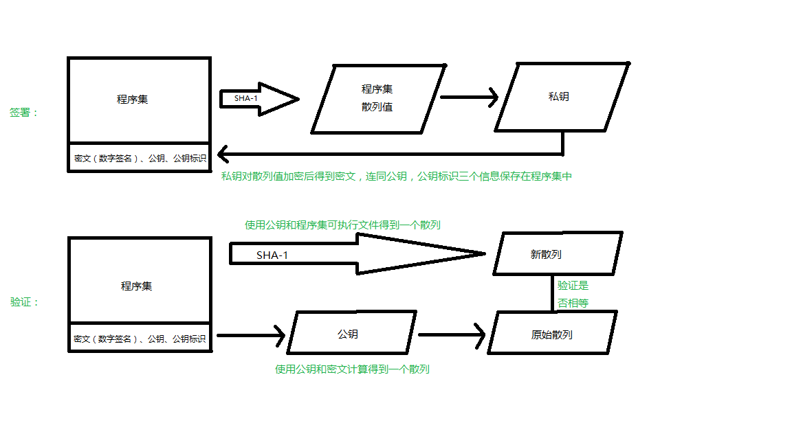

# .NET反保护知识

## 强名称
>小贱提示：
>
>.NET中采用名称来区分（标识）程序集，名称分为强弱两类
>
>弱名称三要素：程序集名称，版本号，地域信息
>
>强名称：在弱名称基础上再加一个要素：数字签名


强名称作用：1、区分不同程序集（包括版本不同）2、标识原作者信息，确保代码不被篡改

看图更直观些：



#### 如何去除和替换强名称
手动去除

```
PE文件的元数据头中共有四处与程序集本身强名称相关的标识（dnspy可以看到）
1、CLR头(也叫Cor20Header或.NET目录)中的flags项，去除COMIMAGE_FLAGS_STRONGNAMESIGHNED标志；
2、CLR头中的StrongNameSignatiure RVA和Size都改为0
3、Assembly表中的Flags项，减去0x0001(PublicKey标识)
4、Assembly表中的Publickey项，只想Blob的偏移，用0填充
```

利用工具
```
方法1（去除）：
推荐工具Strong Name Remove
载入程序后点Verify检测，
Patch用来清除本身强名称（只清除本身）
Patch Reference 用来去除引用信息（选中要去除的dll，只清除选中的dll的）

方法2（替换，通用性更强些）：
工具：Re-Sign
sn.exe复制到c盘
cmd中cd ..\..\
snk -k new.snk其中new.snk就是要替换的签名文件用Re-Sign选择程序和snk

方法3：以上两种都不行的话就用{smartkill}
```
## 名称混淆
>小贱提示：
>
>在#string流中做手脚，修改类型和成员名称
>
>名称混淆可达到三个目的：
>
>隐藏原作者编程意图，增加阅读难度
>
>扰乱反编译软件的代码显示功能
>
>增大通过反编译手段修改源程序的难度

#### 名称混淆的形式
乱码形式
```
采用这种方式的软件包括
9Rays Spices.NET
{smartassembly}
dotNet Protector
Skator
CodeWall
```
无规律长字符串
```
以数字和字母组成无规律长字符串
这类加密软件有：
Xenocode Postbuild
.NET Reactor
```
无规律短字符串
```
软件：CLISecure
```
利用小括号，中括号，大括号
```
Obfuscator.NET使用此类字符混淆
```
#### 反混淆的方法
```
方法1：对反编译代码修改，不改变原文件
Dis#的名称修改功能
dnspy右键也可编辑修改

方法2：
直接修改可执行文件的元数据，将#String流中的数据改为新的名称
```
## 流程混淆
>
>小贱提示：
>
>目的是让反编译软件无法将IL转换为高级语言
>
>scanid看，程序拖到de4dot，scanid看，再de4dot一次，把生成的cleaned放到univeral fixer，点fix assembly，把fix用reflector打开
#### 流程混淆的形式
用直接跳转将代码块易位

连续直接跳转

直接跳转表

逻辑跳转

升级版逻辑跳转

switch跳转

语法混淆

#### 反混淆的方法
针对{smartassembly}：{smartassassin}，{smartkill}

针对Dotfuscator：DeDot

万能反混淆神器De4Dot

如果2层壳，根据他的提示可以将其一层一层的脱掉

(顺序不能错，只能先de4dot 文件名 -p mc,再de4dot 文件名 -p df)


__原创文章，转载请注明转载自[http://www.8pwn.com](http://www.8pwn.com)__

[返回上一层](./reverse)
