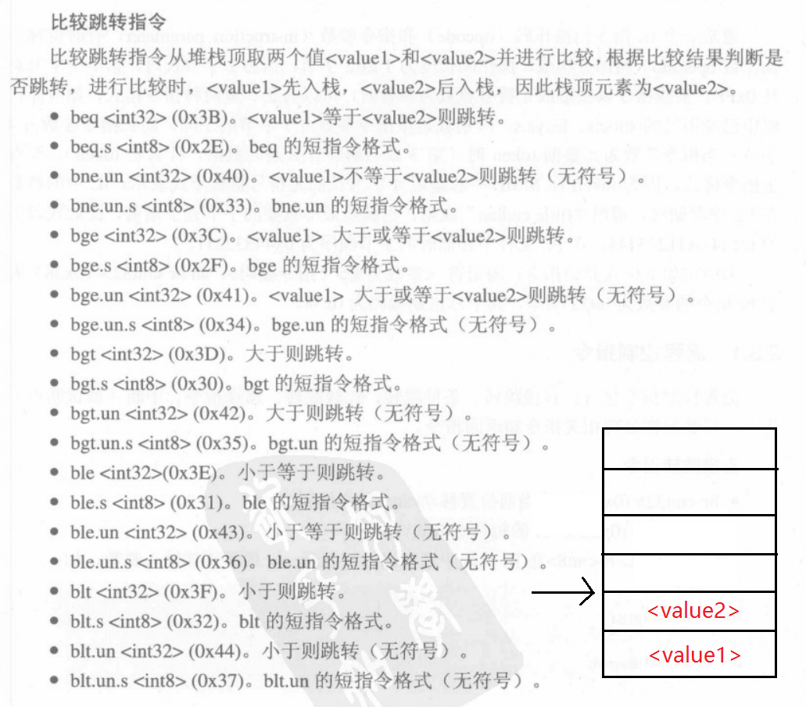

# IL控制流指令


## 直接跳转
#### br
br <int32> ：从当前位置移动<int 32>个位置

br.s <int 8>  ：  br的短指令格式

## 条件跳转
>小贱提示：
>
>非零即真
>
>条件跳转需要从栈顶取个bool类型的值进行比较,假设该值为<value>
>
>注意堆栈平衡，如不让brfalse跳转，那么改成pop，而不是改成nop

#### brfalse
```
brfalse (brzero,brnull) <int32>
如果<value>为0，则跳转<int32>个位置

brfalse.s <int8>    brfalse的短指令格式
```
#### brtrue
```
brtrue (brinst) <int32>
<value>不为0则跳转<int32>个位置
```
## 比较跳转指令
>小贱提示：
>
>比较跳转是将堆栈的两个元素取出来再比较，指令结束后堆栈就已经改变了，爆破的时候一定要注意堆栈的平衡,具体请看下图



## switch
>小贱提示：
>
>switch 会建立跳转表，从栈顶取<unsigned int32>
>
>根据这个<unsigned int32>的值选择跳转目标

```
switch <unsigned int32><int32>...<int32>

写法：
switch(Label1,Label2,Label3,...,LabelN)
......                              //Default case
Label1:
......
Label2:
......
```
## break
调试断点，若处于调试状态，则断下，否则没效果

## 托管异常处理
.NET中，当从try和catch中跳出时，不能使用普通跳转，必须用特殊的leave
#### leave
```
leave <int32>
清空堆栈，从当前跳转<int32>个位置

leave.s <int8>  leave的短指令格式
```
#### endfilter
```
表示filter块的终结，从栈顶去4个字节整数值，
若该值为1，代表该异常应该被处理
若该值不为1，代表继续搜索合适的异常处理
```
#### endfinally
```
表示finally或fault块的终结，并清空堆栈
```
## ret
如果有返回值，栈顶应有相应的值

如果返回值为void，ret执行时堆栈应为空


__原创文章，转载请注明转载自[http://www.8pwn.com](http://www.8pwn.com)__

[返回上一层](./reverse)
