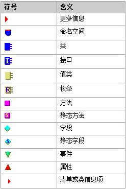

# NET编译与token
## 关于token
>小贱提示： token是元数据项的唯一标识，是一个uint数值AABBBBBBh

```
前一个字节AA指出了它对应的表，后三个字节BBBBBB指出了它在表中的位置
特殊情况，AA=70时，对应的都是用户字符串，后三个字节对应该字符串在#US流中的偏移
IL不直接和内存打交道，而是采用token的方式
```


## 编译C#程序
```
菜单->所有程序->Microsoft .net framework sdk v2.0->SDK command prompt

单程序：csc hello.cs

带dll程序：
csc /r:msglib.dll /t:winexe msgbox.cs
```
>小贱提示： /r是/reference的缩写，/t是/target的缩写

## ildasm与ilasm
首先我们先看下ildasm的各个符号的意义
## 
然后让我们看看各个单词符号的意思

| 符号     | 意义            |
| -------- | --------------- |
| MANIFEST | 清单            |
| Program  | 是一个Program类 |
| .ctor    | 方法            |
| Main     | 静态方法        |
|          |                 |


## round-tripping
>小贱提示： 简单理解就是反编译，然后再编译

```
ildasm中dump后（勾选line numbers，其他默认）：一个资源文件，一个IL文件

修改后直接将俩文件拖到ilasm图标上或用ilasm再编译回去,运行命令：
在SDK命令行中：
ilasm /resource=hellodump.res hellodump.IL               #生成release版
ilasm /debug/resource=hellodump.res hellodump.IL    #生成debug版
```


__原创文章，转载请注明转载自[http://www.8pwn.com](http://www.8pwn.com)__

[返回上一层](./reverse)
