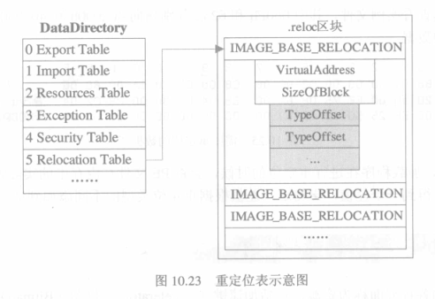

# 代码重定位
>小贱提示： EXE可以不管，但是修补DLL的时候，必须代码重定位

## 基址重定位信息
# 
基址重定位信息用peid查看.reloc段

举例如下(这个地址处的数据是一个IMAGE_BASE_RELOCATION结构)：

| V.Offset | V.Size | R.Offset | R.Size |
| -------- | ------ | -------- | ------ |
| B000     | BF8    | A000     | 1000   |

# 
>小贱提示：
>
>V.偏移是针对基址的偏移，如果基址是10000000，那么od中就是10000000+B000=1000B000
>
>R.偏移（A000）就是文件偏移，即在winhex查看的地址
>
>也就是说.reloc在od中的位置是1000B000,在winhex中的位置是A000

下面介绍下IMAGE_BASE_RELOCATION结构格式（请结合上面的基址重定位示意图）


| 00 10 00 00    | 54 01 00 00 | DF 30 E6 30       | F5 30 FD 30       | 。。。。。。      |
| -------------- | ----------- | ----------------- | ----------------- | ----------------- |
| VirtualAddress | 结构总大小  | 需要重定位的数据1 | 需要重定位的数据2 | 数据3、4、5。。。 |
|                | Size        | TypeOffset        | TypeOffset        | TypeOffset        |


## 修复重定位表
>举个例子吧，便于理解。
>
>想要在DLL中加一个MessageBoxA函数，用LordPE在example.dll输入表中增加个MessageBoxA,其ThunkRVA是C019，
>
>当加入新功能时，最好pushad,popad下，保存现场所有寄存器（以下是dll在ida处做的修改，但是一旦运行起来，dll文件的基址就不确定了，不可能是400000，因为400000会被exe文件占去，这时候就需要对地址进行重定位了）
>
>到达OEP之后，od dump记下'修正为'，打开lord pe，选中程序，右键修正镜像大小，
>
>右键完整转存，剩下的就是用imprec修复iat


```
00401010    60                pushad    //保存现场寄存器
00401011    6A00              push    0
00401013    68105C4000        push    00405C10①   //“PEDIY”
00401018    68005C4000        push    00405C00②   //“HELLO”
0040101D    6A00              push    0
0040101F    FF1519C04000      call    dword ptr [0040C019③]   //调用MessageBoxA
00401025    61                popad                //恢复现场寄存器
```
# 
>小贱提示：
>
>当然这样是不行的，①②③处的地址必须重定位，这三处只是基址是400000时是正确的，如果基址是370000，405C10就不对了
>
>401014h所指向的数据需要重定位，需要重定位的三处地址（RVA）分别是1014h，1019h，1021h
>
>重定位表以1000h为一个段，各减1000，所以这三处重定位项目值为14h,19h,21h.

#### 第二步：算出TypeOffset
```
14 + 3000=3014 ;  19+3000=3019 ; 21 + 3000 =3021
```
# 
>小贱提示：
>
>有的同学会问，3000怎么来的？
>
>还记得刚刚我们查看的TypeOffset吗，查看.reloc处数据的其他TypeOffset，比如其他的TypeOffset是3078,那就是3000

#### 第三步：新构造一个IMAGE_BASE_RELOCATION结构，追加到原重定位表后面
```
VirtualAddress：就按照原重定位表写，如00 10 00 00
结构总大小：写0E 00 00 00(因为还要加上VA和总大小共8个字节)
TypeOffset写第二步算出来的
```
#### 第四步：修改Relocation的size
>小贱提示：
>
>lordPE载入，目录中把重定位的大小修改为：原大小+新增大小(此例为0xE)，比如如原来为514h修改为522h


__原创文章，转载请注明转载自[http://www.8pwn.com](http://www.8pwn.com)__

[返回上一层](./reverse)
