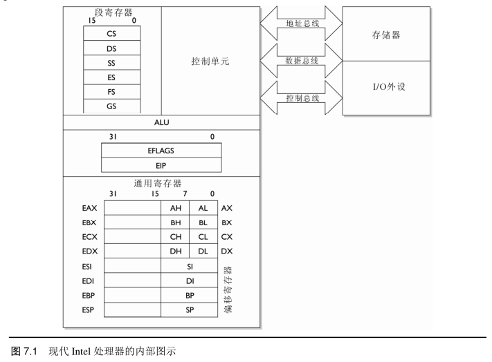
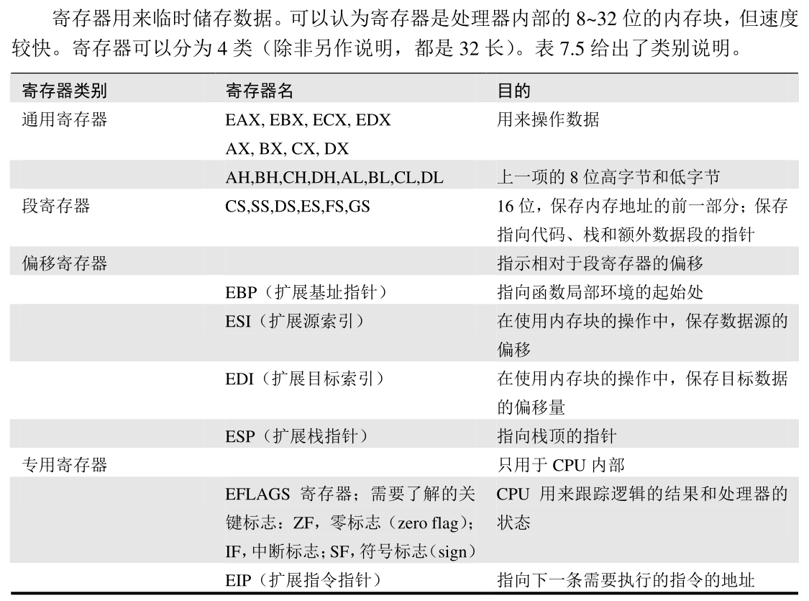

# Inter处理器

## Inter处理器内部示意图

## 寄存器

## 算术逻辑部件（ALU）
算术逻辑部件（Arithmetic Logic Unit，ALU）用来执行数学功能，

如加法、乘法、减法和除法。ALU 也用来执行逻辑功能，如与、或、非。
## 程序计数器（EIP）
程序计数器是一个专用寄存器，

用来存储下一条需要处理的指令的地址，也称之为扩展指令指针（EIP）
## 控制单元
控制单元是 CPU 运行的中心。
可以简化为两个组件
#### 取指/解码单元
 一组锁存器、时钟和总线，可以有效地获取下一条需要处理的指令，并对程序计数器加１，然后解码需要执行的指令。

#### I/O 控制单元
负责与外部 I/O 设备交互。

## 总线
处理器与周边、外部设备之间的信息交换，都是通过称之为总线的设备进行。

与 PC机箱内部的扁平带状电缆类似，处理器的内部总线宽度在 16~64 位之间。

总线越宽，对处理器速度的限制就越小
#### 地址总线
用来选择内存地址，以便读取和写入
#### 数据总线
用来在处理器和内存之间移动数据
#### 控制总线
用来控制外部设备和执行指令

__原创文章，转载请注明转载自[http://www.8pwn.com](http://www.8pwn.com)__

[返回上一层](./system)
