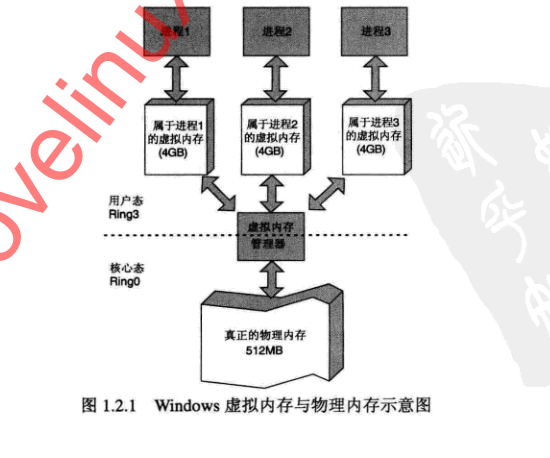

# 虚拟内存与物理内存
>小贱提示：
>
>这里所说的虚拟内存并不是硬盘不够用操作系统用硬盘充当内存的那种虚拟内存

## 代码区

存储被装入执行的二进制机器码，处理器到这个区域取指令并执行

## 数据区

存储全局变量

## 堆区

进程可以在堆区动态地请求一定大小的内存，并在用完之后归还给堆区动态分配和回收是堆区的特点

## 栈区

用于动态存储函数之间的调用关系，以保证被调用函数在返回时恢复到母函数中继续执行

__原创文章，转载请注明转载自[http://www.8pwn.com](http://www.8pwn.com)__

[返回上一层](./system)
