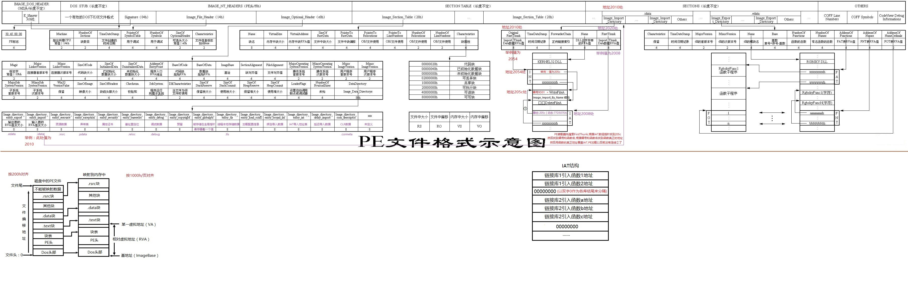

# Window PE结构

## 代码段赋予写权限
方法1：

dump找400000，右键指定pe头，找到第一个区块，看到charactoristics，
把60000020改为E0000020就赋予了写权限了

方法2：

lordPE->PE编辑器->区段->编辑，最后保存

## PE结构详细图

__原创文章，转载请注明转载自[http://www.8pwn.com](http://www.8pwn.com)__

[返回上一层](./system)
