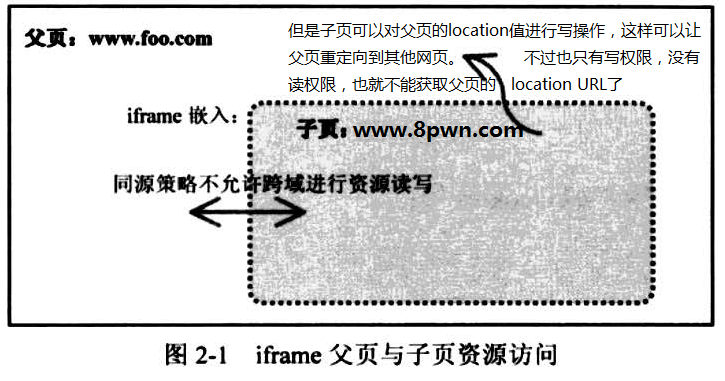

# Cookie安全

## DOM树

\<html\>是树根，其他都是树的节点

标签节点：\<xxx\>

属性节点：@xxx

文本节点：xxx
## iframe

## 子域Cookie机制
相关字段：domain

设置cookie时，如果不指定domain的值，默认就是本域

例如：a.foo.com用js设置一个cookie：document.cookie="test=1"	则domain默认为a.foo.com

a.foo.com域设置cookie时，可以指定domain父级域，如：document.cookie="test=1；domain=foo.com";

这样就可以在不同的子域共享Cookie了

>小贱提示：
>
>注意：domain无法设置为下一级子域或其他外域

## 路径Cookie机制
相关字段：path
设置cookie时，如果不指定path字段，则默认为目标页面的路径

比如：a.foo.com/admin/index.php通过js设置cookie：document.cookie="test=1";
path的值就是/admin/。

js有权设置任意cookie到任意路径下，但是只有目标路径下的页面才有权利读取到该cookie
实现跨路径读取：

比如：/8pwn/路径想读取/admin/路径的cookie，可以通过跨iframe进行dom操作，/8pwn/路径下页面代码如下：
```js
xc=function(src){
var o=document.createElement("iframe");
o.src=src;
document.getElementsByTagName("body")[0].appendChild(o);
o.onload=function(){d=o.contentDocument || o.contentWindow.document;alert(d.cookie);};}('http://a.foo.com/admin/index.php');
```
## HttpOnly Cookie机制
<?php setcookie("test_http",1,time()+3600,"","",0,1);?>

最后一个就是HttpOnly标志，1表示开启，默认为0
## Secure Cookie机制
Secure			:	标志（默认无），有的话，表明Cookie仅通过HTTPS协议安全传输

不过Secure Cookie对于客户端脚本来说是可读写的

举例：对已知的secure cookie进行篡改（path与domain必须一致）

document.cookie="test_secure=hijack;path=/;secure;"
## 本地Cookie与内存Cookie
与过期时间有关（expires字段）紧密相关。

如果没设置过期时间，就是内存Cookie，会随着浏览器的关闭而消失。

但也并不意味着内存Cookie更安全，攻击者只要给Cookie加一个过期字段就攻破了
## Cookie的P3P性质
只有IE执行了该策略，该字段用于标识是否允许目标网站的Cookie被另一个域通过加载目标网站而设置或发送。

举例：

8pwn域通过script或iframe等方式加载了foo域（第三方域），加载时，浏览器是否允许foo域设置自己的cookie，或是否允许发送请求到foo域时，带上foo域已有的cookie。

#### 设置cookie
```
IE下默认是不允许第三方域设置的，除非foo域在响应的时候带上P3P字段：
P3P:CP="CURa ADMa DEVa PSAo PSDo OUR BUS UNI PUR INT DEM STA PRE COM NAV OTC NOI DSP COR"
不用记，只要知道这样设置后：foo域的Cookie就可以被正常设置了，一次设置，终身有效（这个属性Cookie中是看不到的）
```
#### 发送cookie
发送的Cookie如果是内存Cookie：无所谓是否有P3P，都可正常发送。

发送的Cookie如果是本地Cookie：则这个Cookie必须有P3P属性，否则没用。


__原创文章，转载请注明转载自[http://www.8pwn.com](http://www.8pwn.com)__

[返回上一层](./web)
